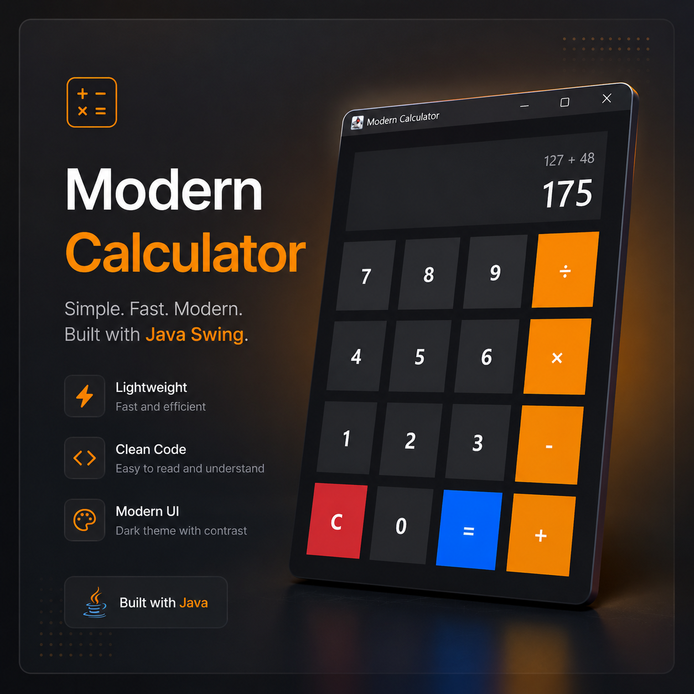

# 🌑 Modern Calculator

A sleek and lightweight calculator built with pure Java Swing.  
Focused on clean UI, beginner-friendly architecture, and modern desktop design.

---

# ✨ Features

✅ Modern dark-mode interface  
✅ Lightweight and fast  
✅ Pure Java Swing (no external libraries)  
✅ Clean and readable code  
✅ Beginner-friendly structure  
✅ Responsive button layout  
✅ Smooth hover effects  
✅ Custom rounded buttons  
✅ Basic arithmetic operations

---

# 🛠 Technologies Used

- ☕ Java
- 🖥 Java Swing
- 🎨 AWT Graphics
- 🧩 Object-Oriented Programming (OOP)

---

# 📂 Project Structure

```text
Modern-Calculator/
│
├── src/
│   └── ModernCalculator.java
│
├── screenshots/
│   └── preview.png
│
├── README.md
├── LICENSE
└── .gitignore
```

---

# ⚡ Getting Started

## 1️⃣ Clone the repository

```bash
git clone https://github.com/LeozinDaMassa/Modern-Calculator.git
```

---

## 2️⃣ Open the project

Open the folder in:

- VS Code
- IntelliJ IDEA
- Eclipse

---

## 3️⃣ Compile the project

```bash
cd src
javac ModernCalculator.java
```

---

## 4️⃣ Run the application

```bash
java ModernCalculator
```

---

# 🎯 Why This Project?

This project was designed to demonstrate:

- Clean Java architecture
- GUI development with Swing
- Modern desktop UI concepts
- Event handling
- Reusable components
- Lightweight software design

Unlike many overcomplicated calculator projects, this application keeps the logic simple and easy to understand while still delivering a polished modern interface.

---

# 🧠 Learning Goals

Perfect for developers learning:

- Java GUI Development
- Swing Components
- Event Listeners
- Custom UI Rendering
- Desktop Applications
- Java Fundamentals

---

# 🔥 Future Improvements

- Scientific mode
- Keyboard support
- Animation system
- Theme switcher
- Better expression parser
- Calculation history
- Memory buttons
- Responsive scaling

---

# 📸 Screenshots

Add your preview image inside:

```text
screenshots/preview.png
```

Then display it with:

```md

```

---

# 🌟 Project Philosophy

This calculator was intentionally built to be:

- Lightweight
- Fast
- Easy to read
- Easy to modify
- Beginner-friendly
- Visually modern

The goal is making Java Swing feel clean and modern without unnecessary complexity.

---

# 👨‍💻 Author

Made with ☕ and late-night coding sessions by Leonardo.

---

# 📄 License

This project is licensed under the MIT License.